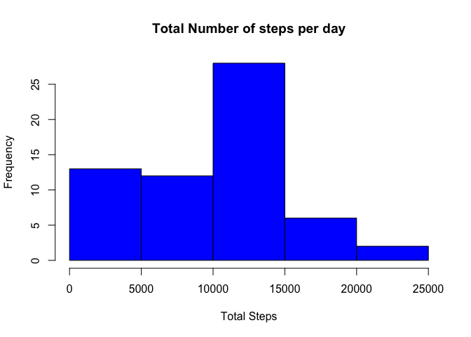
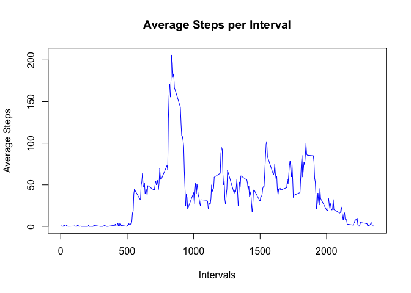
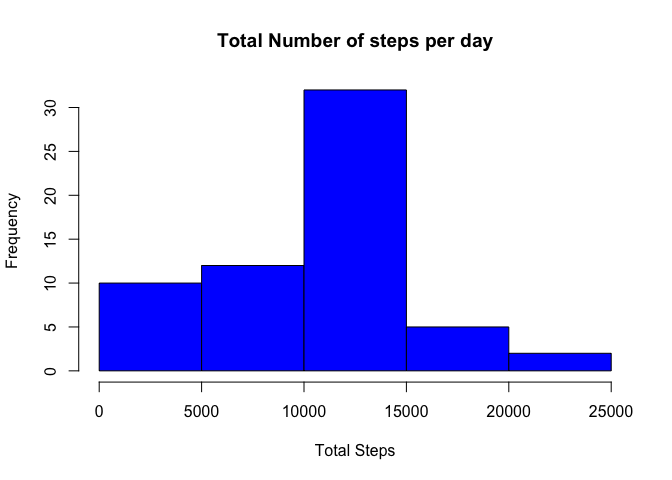
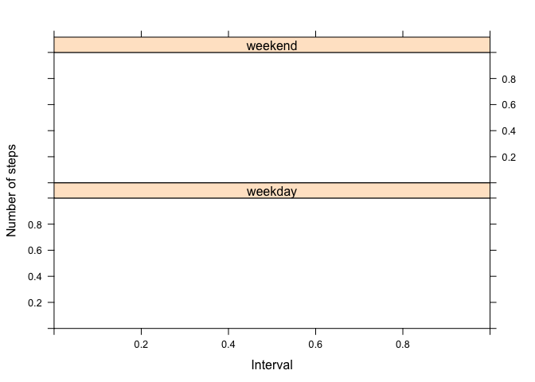

##Assignment Instructions 
1.Code for reading in the dataset and/or processing the data 
2.Histogram of the total number of steps taken each day 
3.Mean and median number of steps taken each day 
4.Time series plot of the average number of steps taken 
5.The 5-minute interval that, on average, contains the maximum number of steps 
6.Code to describe and show a strategy for imputing missing data 
7.Histogram of the total number of steps taken each day after missing values are imputed 
8.Panel plot comparing the average number of steps taken per 5-minute interval across weekdays and weekends 
9.All of the R code needed to reproduce the results (numbers, plots, etc.) in the report 


##Step 1 
##Code for reading in the dataset and/or processing the data 

```r
zipUrl <- "https://d396qusza40orc.cloudfront.net/repdata%2Fdata%2Factivity.zip"
zipFile <- "repdata_data_activity.zip"
sourceFile <- "activity.csv"
destFile <- "plot1.png"
# check if file is downloaded
if (!file.exists(zipFile)) {
    download.file(zipUrl,zipFile,mode="wb")
}
if(!file.exists(sourceFile)){
    unzip(zipFile)
}
dt <- read.csv(sourceFile,header = TRUE,sep = ",")
dt$date <- as.Date(dt$date)
```

##What is mean total number of steps taken per day?

```r
Totalnumberstepsperday <- aggregate(dt$steps,by=list(dt$date),sum,na.rm=TRUE)
names(Totalnumberstepsperday) <- c("Date","Steps")
hist(Totalnumberstepsperday$Steps,col="blue",xlab="Total Steps",main="Total Number of steps per day")
```

<!-- -->

```r
mean(Totalnumberstepsperday$Steps)
```

```
## [1] 9354.23
```

```r
median(Totalnumberstepsperday$Steps)
```

```
## [1] 10395
```
##What is the average daily activity pattern?

```r
Totalnumberstepsperinterval <- aggregate(dt$steps,by=list(dt$interval),mean,na.rm=TRUE)
names(Totalnumberstepsperinterval) <- c("Interval","Steps")
plot(Totalnumberstepsperinterval$Interval,Totalnumberstepsperinterval$Steps,col="blue",type = "l",xlab = "Intervals",ylab = "Average Steps",main = "Average Steps per Interval")
```

<!-- -->

```r
#Which 5-minute interval, on average across all the days in the dataset, contains the maximum number of steps?
Totalnumberstepsperinterval[Totalnumberstepsperinterval$Steps==max(Totalnumberstepsperinterval$Steps),1]
```

```
## [1] 835
```

##Imputing missing values

```r
sum(is.na(dt$steps))
```

```
## [1] 2304
```

```r
dt_NAImputed <- dt
dt_NAImputed_na <- which(is.na(dt_NAImputed$steps))
l <- length(dt_NAImputed_na)
for(i in 1:l){
    
    dt_NAImputed[i,]$steps <- Totalnumberstepsperinterval[Totalnumberstepsperinterval$Interval==dt_NAImputed[i,]$interval,]$Steps
}
Totalnumberstepsperday_NAImputed <- aggregate(dt_NAImputed$steps,by=list(dt_NAImputed$date),sum,na.rm=TRUE)
names(Totalnumberstepsperday_NAImputed) <- c("Date","Steps")
# histogram of the total number of steps taken each day 
hist(Totalnumberstepsperday_NAImputed$Steps,col="blue",xlab="Total Steps",main="Total Number of steps per day")
```

<!-- -->

```r
#mean total number of steps taken per day
mean(Totalnumberstepsperday_NAImputed$Steps)
```

```
## [1] 9728.107
```

```r
#median total number of steps taken per day
median(Totalnumberstepsperday_NAImputed$Steps)
```

```
## [1] 10600
```
##Are there differences in activity patterns between weekdays and weekends?

```r
dt_NAImputed$day <- weekdays(dt_NAImputed$date)
for(i in 1:nrow(dt_NAImputed)){
    
    
    if(dt_NAImputed[i,]$day %in% c("Saturday","Sunday"))
    {
        dt_NAImputed[i,]$day <- "weekend"
    }
    else{
        dt_NAImputed[i,]$day <- "weekday"
    }
    
}
    
AvgstepsByweekday <- aggregate(dt_NAImputed$steps,by=list(dt_NAImputed$day,dt_NAImputed$interval),mean)
names(AvgstepsByweekday) <- c("day","interval","mean_steps")
    
library(lattice)
    xyplot(mean_steps ~ interval | day, AvgstepsByweekday, type = "l", layout = c(1, 2), 
           xlab = "Interval", ylab = "Number of steps")
```

<!-- -->
